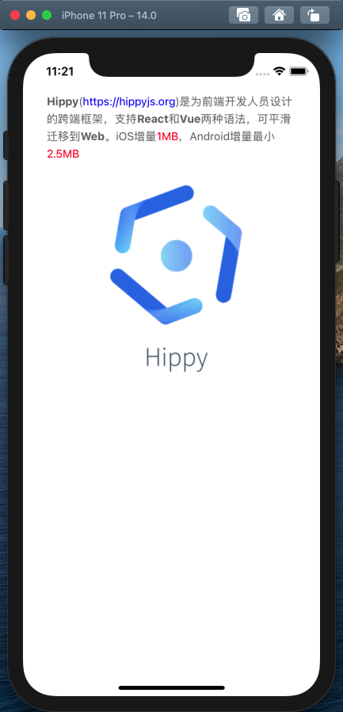

# hippy-vue-html
hippy-vue-html是vue版本的零依赖hippy富文本组件，支持解析传入的HTML片段并渲染成hippy可以支持的vue结构。目前支持了hippy原生支持的`button`、`div`、`img`、`span`、`p`、`ul`、`span`等标签，进行了一些转化并支持了`a`、`b`、`strong`等标签，其他标签则不解析或转化为span标签(div标签在hippy中不显示text)。

欢迎MR与issues，一起学习。

## 安装
```bash
# 推荐使用yarn安装
yarn add hippy-vue-html
# 或使用npm安装
npm install -S hippy-vue-html
```

## 配置
#### 参数

| 参数 | 说明             | 类型   | 可选值 | 默认值 |
| ---- | ---------------- | ------ | ------ | ------ |
| html | 要渲染的html原文 | String | -      | -      |
| styles | 针对标签的默认css样式 | Object | -      | -      |

#### 事件

| 事件名称   | 说明            | 回调参数                                        |
| ---------- | --------------- | ----------------------------------------------- |
| link-press | 点击a标签的事件 | a标签的href属性，给上游hippy项目用来打开webview |

## 例子
引入：
```vue
import Vue from 'vue';
import HippyVueHtml from 'hippy-vue-html';

Vue.use(HippyVueHtml);
```
使用：
```vue
<template>
    <hippy-vue-html :html="text" :styles="styles" @link-press="pressed"></hippy-vue-html>
</template>
<script>
    export default {
      data() {
        return {
          text: '<p style="line-height: 22px;color: #666666;"><b>Hippy</b>(<a href="https://hippyjs.org">https://hippyjs.org</a>)是为前端开发人员设计的跨端框架，支持<b>React</b>和<b>Vue</b>两种语法，可平滑迁移到<b>Web</b>。iOS增量<p style="color: red;">1MB</p>，Android增量最小<p style="color: red;">2.5MB</p></p>',
          styles: {
            p: {
              color: '#666666'
            },
            img: {
              height: 400,
              width: 400,
            }
		      }
        };
      },
      methods: {
        pressed(url) {
          console.log(url);
        }
      }
    };
</script>
```


## 使用说明
- 解析过程会忽略web原生的onClick等handler，因为大部分web脚本里的DOM操作、网络传输等都无法直接在hippy环境当中使用。
- （img标签）hippy需要img指定height/width，暂不支持图片的自适应。如果没有在img标签style中传入height与width，则默认为100px*100px
- （a标签）点击a标签时会触发link-press事件，传递的参数为a标签指定的href